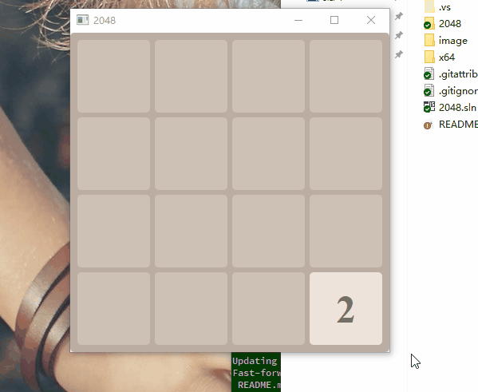

# 2048
使用Qt实现2048 小游戏

## 依赖
* Qt 5.9 or later
* Visual stuido 2017 or later

## 操作
* 键盘控制

## 已知问题
* 在style中固定写死了字体大小,文字过多时会显示异常,看下style中是否存在一种锚定布局,根据方格的大小和显示问题的多少自动设置字体大小
* 结局判断还有点问题
* 合并的方格的时候,因为算法的问题,可能会在一行上合并多次, 比如: 2 2 4 4 ->(右滑) 0 0 4 8, 正确结果应该是: 0 2 2 8
